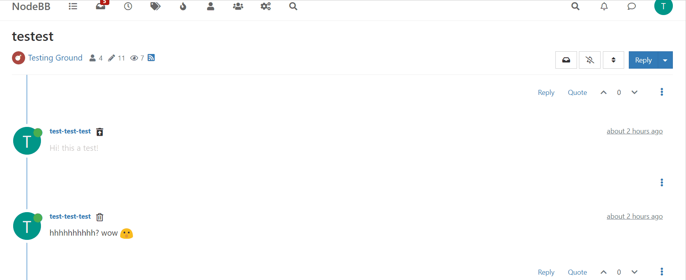

# הוספת כפתור מחיקה/שחזור פוסט מעל הפוסטים

הוספת כפתור מעל הפוסטים ,לפוסט רגיל - כפתור למחיקה, לפוסט מחוק - כפתור לשחזור.

למשתמש רגיל - מעל הפוסטים שלו. לadmin/Global Moderator - מעל כל הפוסטים.

הסקריפט תומך בלוקליזציה באופן מלא ומובנה באמצעות מערכת השפה המובנית של NodeBB עבור 40 שפות.

# הדגמה

